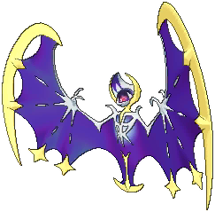
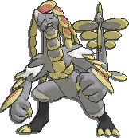
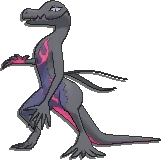
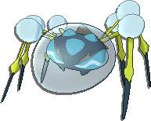

  Pokémon Moon Team

<table align="center">

  <tr>
    <td align="center"></td>
    <td align="center"></td>		
    <td align="center"></td>
    <td align="center"></td>
    <td align="center"></td>
    <td align="center"></td>
  </tr> 

  <tr>
    <td align="center"><a href="http://pokemondb.net/pokedex/lunala" target="_blank">Lunala</a></td>
    <td align="center"><a href="http://pokemondb.net/pokedex/solgaleo" target="_blank">Solgaleo</a></td>		
    <td align="center"><a href="http://pokemondb.net/pokedex/kommo-o" target="_blank">Kommo-o</a></td>
    <td align="center"><a href="http://pokemondb.net/pokedex/lycanroc" target="_blank">Lycanroc</a></td>
    <td align="center"><a href="http://pokemondb.net/pokedex/salazzle" target="_blank">Salazzle</a></td>
    <td align="center"><a href="http://pokemondb.net/pokedex/araquanid" target="_blank">Araquanid</a></td>
  </tr> 

</table>

 

  Facebook Friends

 <iframe width="760" height="300" frameborder="0" scrolling="no" src="/dashboard/scripts/fb-chart/"></iframe>

  Twitter Followers

 <iframe width="760" height="300" frameborder="0" scrolling="no" src="/dashboard/scripts/twitter-chart/"></iframe>
 

<iframe src="//www.facebook.com/plugins/share_button.php?href=http://stefanos990.com/dashboard&amp;layout=button_count&amp;appId=460671367340473&amp;text=Dashboard" scrolling="no" frameborder="0" style="border:none; overflow:hidden; width:100px;" allowTransparency="true"></iframe>

<iframe id="tweet-button" allowtransparency="true" frameborder="0" scrolling="no" src="http://platform.twitter.com/widgets/tweet_button.html?via=stefanos990&amp;count=horizontal&amp;url=http://stefanos990.com/dashboard&amp;text=Dashboard"></iframe>

