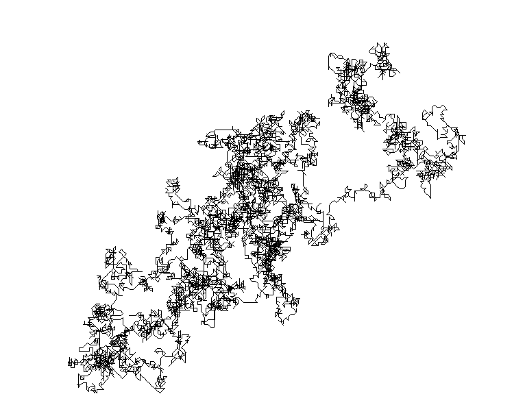
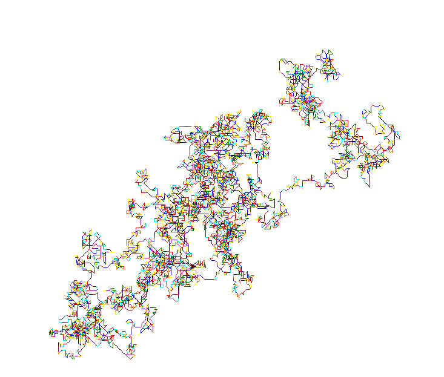

  What is "Pi"?

The number <strong>π</strong> is a mathematical constant, the ratio of a circle's circumference to its diameter, commonly approximated as 3.14159. It has been represented by the Greek letter "π" since the mid-18th century, though it is also sometimes spelled out as "pi" (<a href="https://translate.google.com/translate_tts?ie=UTF-8&q=pi&tl=en&total=1&idx=0&textlen=7&client=t&prev=input">/paɪ/</a>).

Being an irrational number, π cannot be expressed exactly as a common fraction, although fractions such as 22/7 and other rational numbers are commonly used to approximate π. Consequently its decimal representation never ends and never settles into a permanent repeating pattern. The digits appear to be randomly distributed; however, to date, no proof of this has been discovered.

More on <a href="http://en.wikipedia.org/wiki/Pi" target="_blank">Pi</a>

 

  The Illustration Concept

So what's the concept here? I thought, what if I could match each of pi's digits to a direction and then draw some of them to see the illustration of some of pi's digits? And so I did. Here is the matching table and the direction concept explained graphically.

<table align="center">
  <tr>
    <th>Digit</th>
    <th>Angle</th>		
    <th>Direction</th>
    <th>Compass</th>
  </tr>

  <tr>
    <td align="center">1</td>
    <td align="center">0°</td>		
    <td align="center">East</td>
    <th rowspan="9"> </th>
  </tr> 

  <tr>
    <td align="center">2</td>
    <td align="center">45°</td>		
    <td align="center">Northeast</td>
  </tr> 

  <tr>
    <td align="center">3</td>
    <td align="center">90°</td>		
    <td align="center">North</td>
  </tr> 

   <tr>
    <td align="center">4</td>
    <td align="center">135°</td>		
    <td align="center">Northwest</td>
  </tr> 

   <tr>
    <td align="center">5</td>
    <td align="center">180°</td>		
    <td align="center">West</td>
  </tr> 

   <tr>
    <td align="center">6</td>
    <td align="center">225°</td>		
    <td align="center">Southwest</td>
  </tr> 

   <tr>
    <td align="center">7</td>
    <td align="center">270°</td>		
    <td align="center">South</td>
  </tr>  

  <tr>
    <td align="center">8</td>
    <td align="center">315°</td>		
    <td align="center">Southeast</td>
  </tr> 

   <tr>
    <td align="center">9</td>
    <td align="center">360°</td>		
    <td align="center">East</td>
  </tr>    
</table>
 

  The Code Implementation

Since I kinda like Python, I used Python's turtle library - a drawing library - to read pi's first 10,000 digits from a <a href="../projects/pi10k.txt">text</a> file, put them in a list and then after the matching method let the turtle make some drawing!

 

What if I put some color matching beside direction matching? Hmmm. Things are getting more interesting and the graphic illustration result should now provide us with more information about the "randomness" of digits in pi. The colors I've chosen to represent each digit are: 1, 2, 3, 4, 5, 6, 7, 8, 9

 

  The Result

Voila! Here's how the first 10,000 pi's digits are illustrated.

<table align="center">
  <tr>
    <th>10k Digits</th>
    <th>10k Digits with color</th>		
  </tr>

  <tr>
    <td align="center"></td>
    <td align="center"></td>	
  </tr>
  </table>
   

<iframe src="//www.facebook.com/plugins/share_button.php?href=http://stefanos990.com/projects/illustrating-pi&amp;layout=button_count&amp;appId=460671367340473&amp;text=Illustrating Pi" scrolling="no" frameborder="0" style="border:none; overflow:hidden; width:100px;" allowTransparency="true"></iframe>

<iframe id="tweet-button" allowtransparency="true" frameborder="0" scrolling="no" src="http://platform.twitter.com/widgets/tweet_button.html?via=stefanos990&amp;count=horizontal&amp;url=http://stefanos990.com/projects/illustrating-pi&amp;text=Illustrating Pi"></iframe>



 



