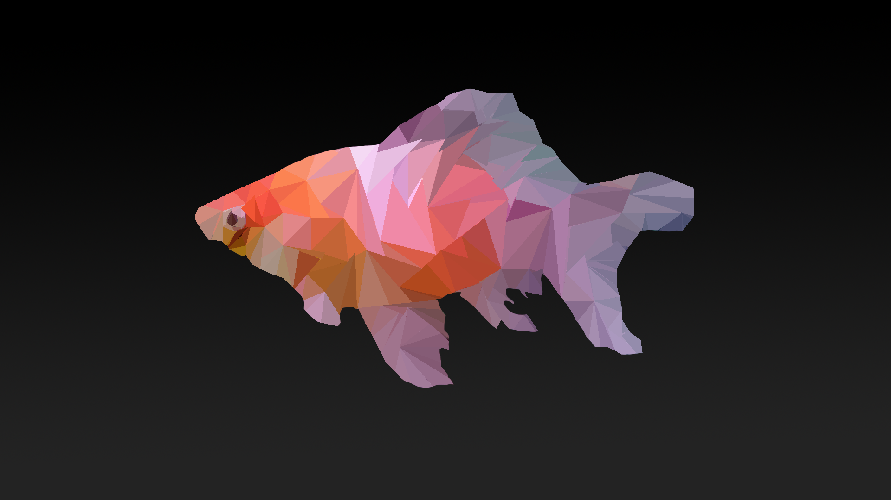
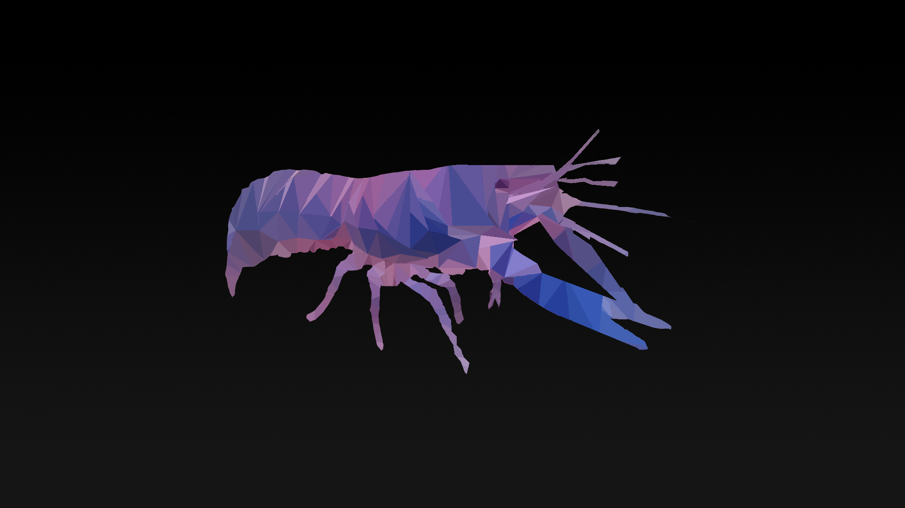

  What is "Low-Poly Imaging"?

Low-Poly Imaging, basically is a polygon mesh in 3D computer graphics that has a relatively small number of polygons. Low-Poly meshes occur in real-time applications (e.g. games) and contrast with high poly meshes in animated movies and special effects of the same era. The term low poly is used in both a technical and a descriptive sense; the number of polygons in a mesh is an important factor to optimize for performance but can give an undesirable appearance to the resulting graphics.

More on <a href="https://en.wikipedia.org/wiki/Low_poly" target="_blank">Low-Poly</a>

 

  Is that a bad or a good thing?

The result of low-poly imaging, as said before, usually has an undiserable appearance, but quaintly, in some cases, low-poly imaging produces a very stunning and pleasing in the eye result! It makes photos look more simple, minimalistic and modern-age-ish.

I first encountered low-poly images from a professional art director & illustrator, <a href="http://justinmaller.com/" target="_blank">Justin Maller</a> and I was so amazed by the result, that I decided to give it a try!

 

  How is it done?

The basic idea of low-poly imaging, is to split a desired photo into triangles (or any other polygon you like), and apply Average (Gausian) Blur Filter on each triangle until you transform the photo into blurry polygons that produce this stunning result!

You can watch this awesome and super simple tutorial on YouTube:

<iframe width="560" height="315" src="https://www.youtube.com/embed/MSAGUhzA-90" frameborder="0" allowfullscreen></iframe>

More on <a href="https://en.wikipedia.org/wiki/Gaussian_blur" target="_blank">Gaussian Blur Filter</a>

 

  My first attempt

Even I was surprised by the simplicity of this kind of art. It took me about 3 hours total in Adobe Photoshop CC to produce the following two images and I think they are quiet good for a first-timer.

 

<table align="center">
  <tr>
    <th>Low-Poly Goldfish</th>
    <th>Low-Poly Lobster</th>		
  </tr>

  <tr>
    <td align="center"></td>
    <td align="center"></td>	
  </tr>
  </table>
   

<iframe src="//www.facebook.com/plugins/share_button.php?href=http://stefanos990.com/projects/low-poly&amp;layout=button_count&amp;appId=460671367340473&amp;text=Low-Poly Imaging" scrolling="no" frameborder="0" style="border:none; overflow:hidden; width:85px;" allowTransparency="true"></iframe>

<iframe id="tweet-button" allowtransparency="true" frameborder="0" scrolling="no" src="http://platform.twitter.com/widgets/tweet_button.html?via=stefanos990&amp;count=horizontal&amp;url=http://stefanos990.com/projects/low-poly&amp;text=Low-Poly Imaging"></iframe>

